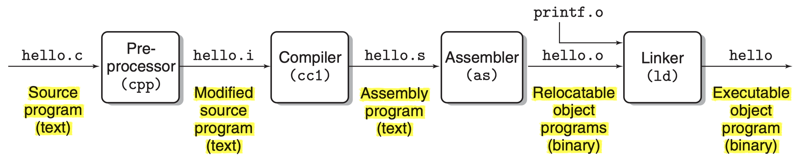
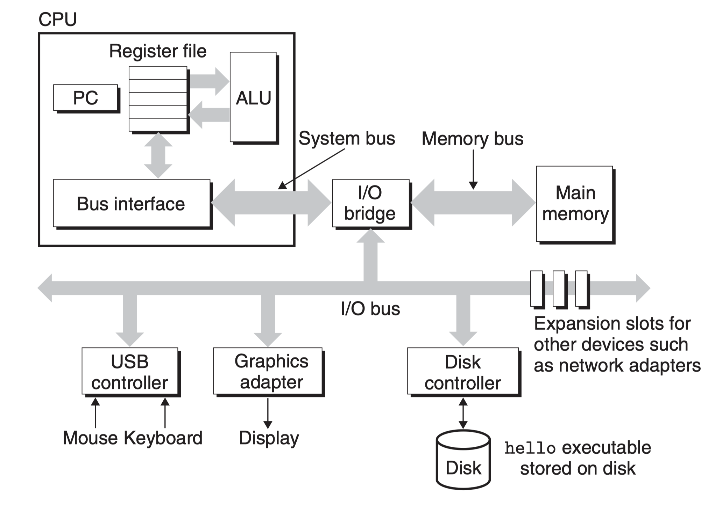
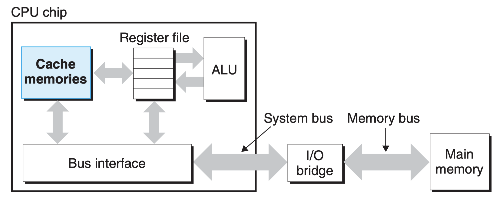
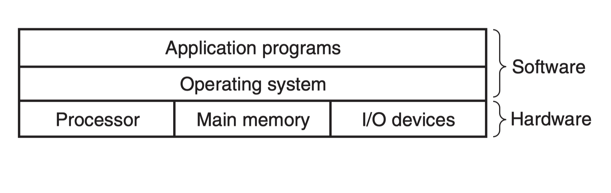
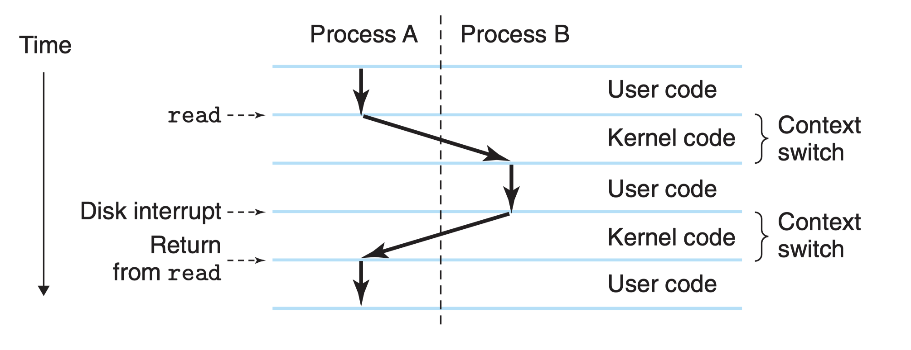
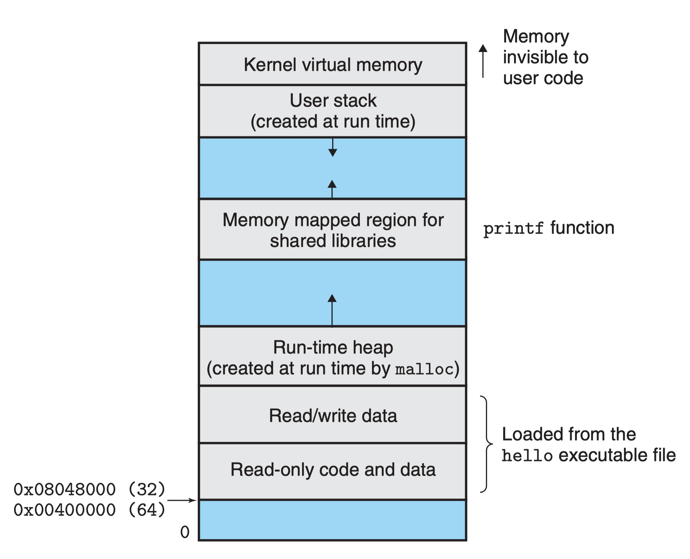
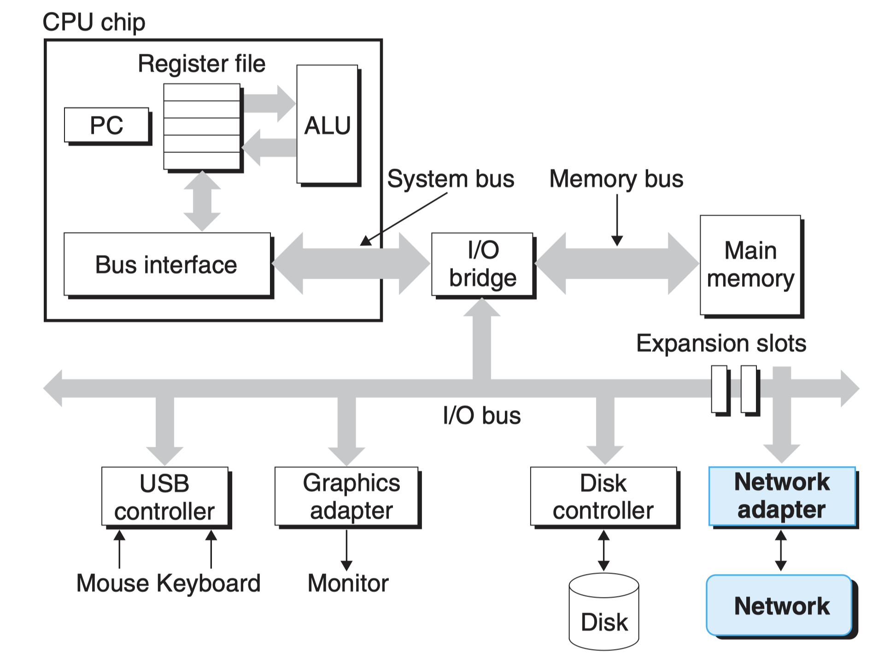

# Chapter 1
## The compilation system



.c -> .i -> .s -> .o -> 

text -> text -> text -> binary -> binary

The programs that perform the four phases which are preprocessor, compiler, assembler, and linker.

1. Preprocessing phase: modifying the original C program according to directives that begin with the # character
2. Compilation phase: translating the text file hello.i into the text file hello.s, which contains an assembly-language program
3. Assembly phase: translating hello.s into machine-language instructions, packaging them in a form known as a relocatable object program, and storing the result in the object file ```hello.o```
4. Linking phase: handling merging the precompiled object file called ```printf.o``` with ```hello.o```

## Hardware Organization of a System



1. Buses
2. I/O Devices
3. Main Memory: Physically, main memory consists of a collection of dynamic random access memory (DRAM) chips.
4. Processor: At its core is a word-sized storage device (or register) called the program counter (PC). There are only a few of these simple operations, and they revolve around main memory, the register file, and the arithmetic/logic unit (ALU).

## Cache



The L1 and L2 caches are implemented with a hardware technology known as static random access memory (SRAM).

## Operating System

1. to protect the hardware from misuse by runaway applications
2. to provide applications with simple and uniform mechanisms for manipulating complicated and often wildly different low-level hardware devices



### Processes

A process is the operating system’s abstraction for a running program. The operating system keeps track of all the state information that the process needs in order to run. This state, which is known as the context, includes information such as the current values of the PC, the register file, and the contents of main memory.



### Threads

In modern systems a process can actually consist of multiple execution units, called threads, each running in the context of the process and sharing the same code and global data.

### Virtual Memory

Virtual memory is an abstraction that provides each process with the illusion that it has exclusive use of the main memory. Each process has the same uniform view of memory, which is known as its virtual address space.



1. Heap: The heap expands and contracts dynamically at run time as a result of calls to C standard library routines such as malloc and free
2. Shared library: Near the middle of the address space is an area that holds the code and data for shared libraries such as the C standard library and the math library.
3. Stack: At the top of the user’s virtual address space is the user stack that the compiler uses to implement function calls.
4. Kernel virtual memory: The kernel is the part of the operating system that is always resident in memory. The top region of the address space is reserved for the kernel.

### Files

A file is a sequence of bytes, nothing more and nothing less. Every I/O device, including disks, keyboards, displays, and even networks, is modeled as a file.

## Communication with Network

